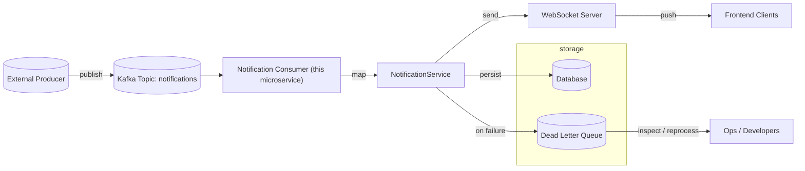

# Notification Service — Architecture Rapport

## Overview

This microservice acts as a Kafka consumer for notification events and as a WebSocket gateway to deliver real-time notifications to frontend clients. Failed deliveries and processing errors are recorded in a Dead Letter Queue (DLQ) to help operations and developers diagnose and reprocess problematic messages.

**Primary responsibilities**
- Consume notification events from a Kafka topic.
- Persist notification records and user-notification links.
- Push notifications to connected frontend clients over WebSocket.
- Record failed messages to a Dead Letter Queue for inspection and reprocessing.

**Why this matters**: Decouples event producers from frontend clients, provides reliable delivery with visibility into failures.

## Diagram

## Components & Roles (detailed)

- `NotificationConsumer`:
  - Role: subscribes to the Kafka topic and receives notification events.
  - Action: validates and maps incoming events into domain objects (uses `NotificationEventMapper`).
  - On success: forwards event to `NotificationService` for persistence and delivery.
  - On processing exceptions: records the raw event + error into the Dead Letter Queue via `DeadLetterQueueService`.

- `NotificationService`:
  - Role: core business logic for handling notifications.
  - Actions: persist `Notification` entity, create `UserNotification` entries, coordinate delivery (push, retries), and update statuses.
  - Failure handling: if delivery or processing fails after configured retries, create a `DeadLetterQueue` record that includes payload, exception message, stack trace (or summary), timestamp, and attempt count.

- `PushNotificationService` / WebSocket layer:
  - Role: manage active client connections and deliver notifications in real time.
  - Implementation notes: configured via `WebSocketConfig` and uses an internal messaging template or session registry to target specific users or broadcast.
  - Fallbacks: if a target user is not connected, `UserNotification` is stored with `Status.PENDING` so the frontend can fetch missed notifications on reconnect.

- `Dead Letter Queue (DLQ)`:
  - Role: durable store for messages that failed processing or delivery.
  - Contents: original payload, metadata (topic, partition, offset if available), error details, timestamp, and attempt counter.
  - Uses:
    - Diagnostics: developers inspect DLQ entries to determine root cause (schema mismatch, downstream errors, malformed payloads).
    - Replay / Reprocessing: optionally re-publish DLQ entries after fixes or use an admin tool to replay.
    - Alerting: high DLQ rate should trigger alerts for operations teams.

## How failures flow
1. Consumer receives event.
2. Processing or delivery fails (example: mapping exception, DB error, websocket serialization error).
3. Service increments attempt counter and retries according to policy.
4. After retries exhausted, service writes a `DeadLetterQueue` record and (optionally) sends an alert.

## Operational recommendations
- Logging: include correlation IDs and the original event snapshot when writing DLQ entries.
- Monitoring: track consumer lag, DLQ rate, websocket connection counts, and push success/failure metrics.
- Reprocessing workflow: provide an admin endpoint or tool that reads DLQ entries, allows triage (fix payload or mapping), and re-publishes to the Kafka topic or triggers a re-run.

## References (source files)
- `NotificationConsumer`: [src/main/java/ma/fstt/notificationservice/kafka/NotificationConsumer.java](src/main/java/ma/fstt/notificationservice/kafka/NotificationConsumer.java)
- `NotificationService`: [src/main/java/ma/fstt/notificationservice/services/NotificationService.java](src/main/java/ma/fstt/notificationservice/services/NotificationService.java)
- `PushNotificationService`: [src/main/java/ma/fstt/notificationservice/services/PushNotificationService.java](src/main/java/ma/fstt/notificationservice/services/PushNotificationService.java)
- WebSocket config: [src/main/java/ma/fstt/notificationservice/config/WebSocketConfig.java](src/main/java/ma/fstt/notificationservice/config/WebSocketConfig.java)
- Dead Letter entity: [src/main/java/ma/fstt/notificationservice/entities/DeadLetterQueue.java](src/main/java/ma/fstt/notificationservice/entities/DeadLetterQueue.java)
- Dead Letter repository/service: [src/main/java/ma/fstt/notificationservice/repositories/DeadLetterQueueRepository.java](src/main/java/ma/fstt/notificationservice/repositories/DeadLetterQueueRepository.java)

## Quick summary

This microservice is the bridge between backend event producers and frontend clients: it consumes Kafka events, persists notifications, delivers them over WebSocket, and stores failed messages in a Dead Letter Queue so teams can diagnose and recover from errors.

